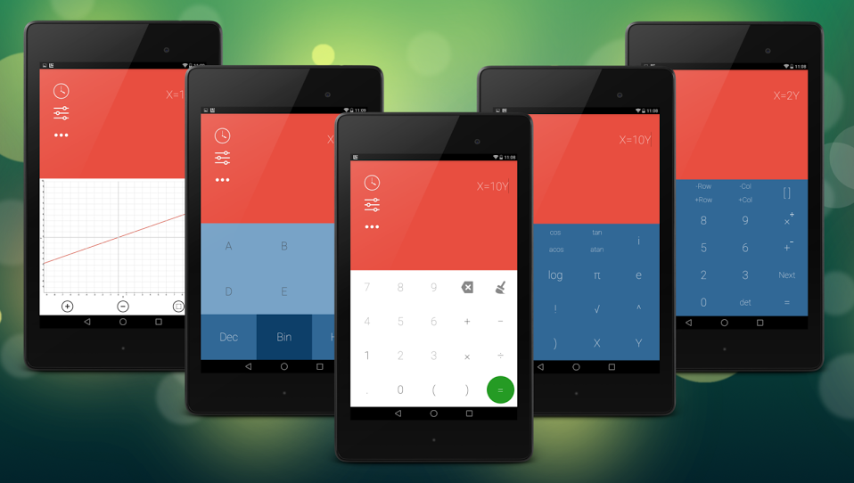

Numix Calculator for Android
==============

### CALCULATE WITH STYLE
Numix Calculator is yet another calculator app, only more stylish then the rest. The design of the app follows the new material design guidelines as much as possible, which results in a modern day looking colourful interface.
Swipe from the left and right to get advanced functions panes or use the three dots button below the sliders in the top left of the input box to do the same. Use the buttons on the left of the input box to open advanced functions panes and preferences.

### FUNCTIONS:
The calculator support all the basic functions (+, -, * and /), but it also has advanced pane that allows thing like trigonometric functions and more advanced functions.

### INSTALLATION:
Simply install the app from [Google Play](https://play.google.com/store/apps/details?id=com.numix.calculator) or [F-Droid](https://f-droid.org/repository/browse/?fdid=com.numix.calculator) :)

### HOW TO BUILD:
Our code is designed for Android Studio. To build it correctly:
- Install Android Studio;
- Click on Open Project;
- Select project folder;
- Enjoy!

Licensed under [MIT Licence](LICENSE.txt).
